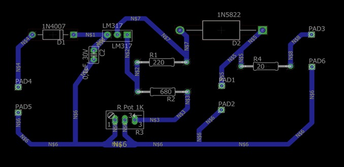
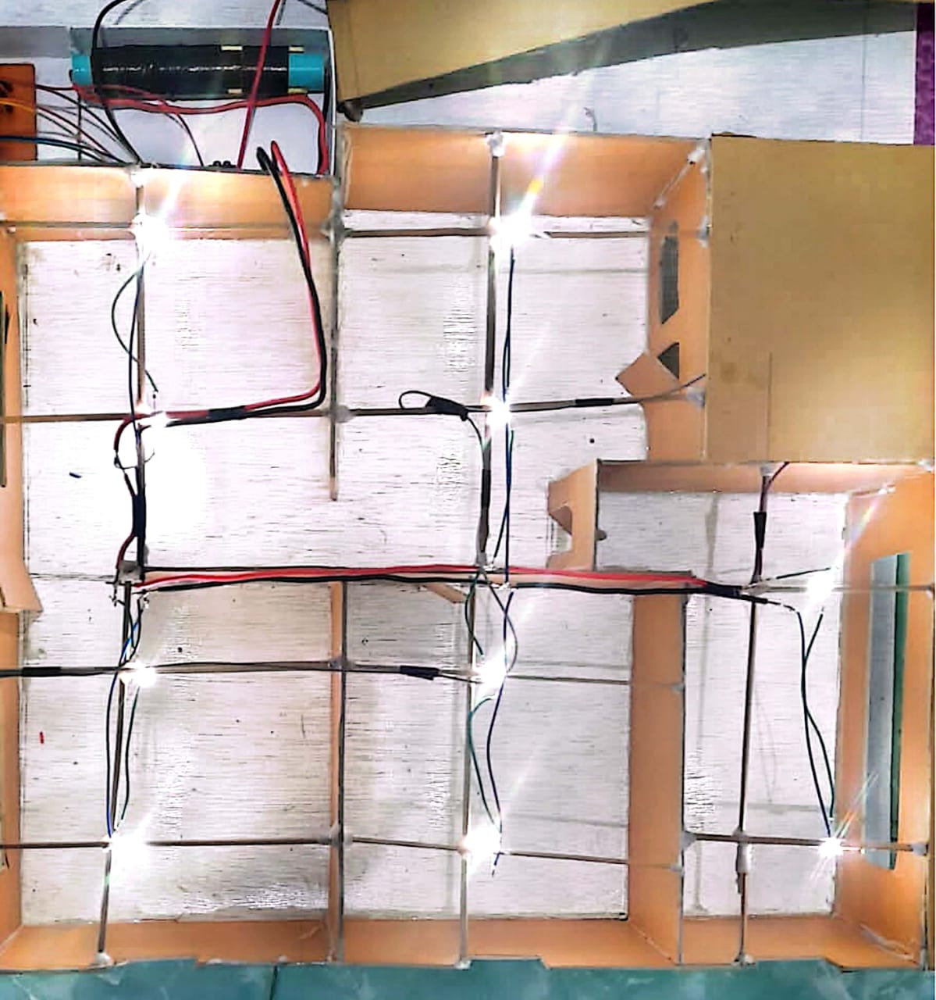

# Independent-Energy-Home

### Project 
- Designing an Energy Independent House equipped with solar panels as a solution for saving electricity ( renewable energy)
- The appli cation of solar panel technology on a household scale, especially in energy independent home prototypes , is a significant step in changing the paradigm of energy use. By utilizing sunlight as the main energy source, energy independent homes can meet daily electricity needs without needing to load the public electricity grid.
- The home prototypes designed using Sketchup
- The schematic circuit on PCB board designed using Eagle Software
- This project was done by 3 people
  
---
### Hardware Use
- Resistor 
- Capasitor
- Diode 1N4007
- Diode 1N5822
- LM317
- Transistor
- LED
- Cables
- Battery
- Solar Panel
  
### The Electrical Schematic Circuit on PCB

### The Electrical Circuit OF Lights

### The Prototype

